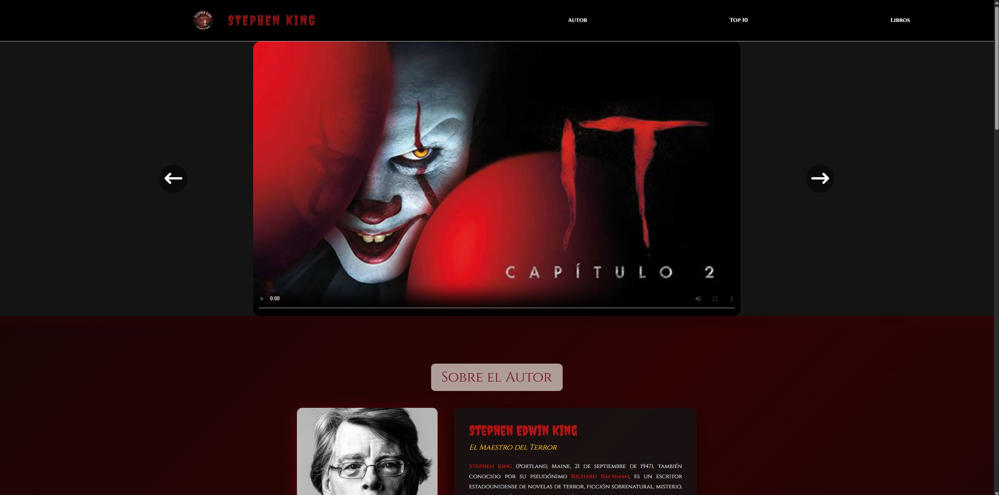
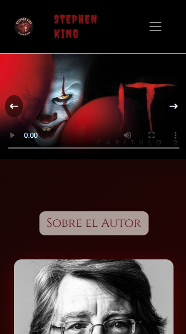

# 📚 Stephen King - React App

> Aplicación web desarrollada en **React** que consume la API de Stephen King para mostrar información detallada sobre sus libros, villanos y adaptaciones cinematográficas.

[](https://reactjs.org/)
[](https://axios-http.com/)
[](https://getbootstrap.com/)
[](LICENSE)

---

## 🎯 Características Principales

✨ **Funcionalidades destacadas:**

- 🔍 **Consumo de API REST** con Axios
- 📱 **100% Responsive** - Móvil, Tablet y Desktop
- 🎬 **Carrusel de videos** de adaptaciones cinematográficas
- 📖 **Top 10 mejores libros** de Stephen King
- 📊 **Tabla completa** con todos los libros de la API
- 👤 **Biografía del autor** con estadísticas
- 🎨 **Tema oscuro** con diseño terrorífico
- ⚡ **Estados de carga** y manejo de errores
- 🧹 **Clean Code** y código bien organizado
- 🎭 **Animaciones suaves** y efectos hover

---

## 🚀 Demo en Vivo

🌐 **[Ver Demo en Vercel](https://stephen-king-react-8zzg-n5q7w16w3-javiers-projects-187bb585.vercel.app/)**

---

## 📸 Capturas de Pantalla

### Desktop


### Tablet


### Móvil


---

## 🛠️ Tecnologías Utilizadas

| Tecnología | Versión | Uso |
|------------|---------|-----|
| **React** | 18.2.0 | Framework JavaScript para UI |
| **Axios** | 1.6.0 | Cliente HTTP para consumir APIs |
| **Bootstrap** | 5.3.8 | Framework CSS responsive |
| **Font Awesome** | 6.5.1 | Librería de iconos |
| **Google Fonts** | - | Tipografías (Creepster, Cinzel) |

### Dependencias principales:
```json
{
  "react": "^18.2.0",
  "react-dom": "^18.2.0",
  "axios": "^1.6.0",
  "react-scripts": "5.0.1",
  "web-vitals": "^3.5.0"
}
```

---

## 📁 Estructura del Proyecto
```
stephen-king-react/
│
├── 📁 public/
│   ├── 📁 data/
│   │   └── cardsAndTable.json         # Top 10 libros
│   ├── 📁 images/                     # Imágenes (portadas, logos, iconos)
│   │   ├── aboutHe/
│   │   ├── background/
│   │   ├── bookCovers/
│   │   ├── carrousel/
│   │   └── logo/
│   ├── 📁 videos/                     # Videos del carrusel
│   ├── 📁 pdf/                        # Documentos legales
│   └── index.html                     # HTML principal
│
├── 📁 src/
│   ├── 📁 components/                 # Componentes React
│   │   ├── Header.jsx                 # Barra de navegación
│   │   ├── Footer.jsx                 # Pie de página
│   │   ├── Carousel.jsx               # Carrusel de videos
│   │   ├── AboutAuthor.jsx            # Biografía del autor
│   │   ├── BookCard.jsx               # Tarjeta de libro individual
│   │   ├── TopTenBooks.jsx            # Grid del Top 10
│   │   └── BooksTable.jsx             # Tabla completa de libros
│   │
│   ├── 📁 services/                   # Lógica de negocio
│   │   └── stephenKingService.js      # Servicio API con Axios
│   │
│   ├── 📁 styles/                     # Estilos CSS modulares
│   │   ├── App.css
│   │   ├── Header.css
│   │   ├── Footer.css
│   │   ├── Carousel.css
│   │   ├── AboutAuthor.css
│   │   ├── BookCard.css
│   │   ├── TopTenBooks.css
│   │   └── BooksTable.css
│   │
│   ├── App.js                         # Componente principal
│   ├── index.js                       # Punto de entrada
│   ├── index.css                      # Estilos globales
│   └── reportWebVitals.js             # Métricas de rendimiento
│
├── .gitignore                         # Archivos ignorados por Git
├── package.json                       # Dependencias del proyecto
├── vercel.json                        # Configuración de Vercel
└── README.md                          # Este archivo
```

---

## 🚀 Instalación y Configuración

### Prerrequisitos

Antes de comenzar, asegúrate de tener instalado:

- [Node.js](https://nodejs.org/) v14 o superior
- npm o yarn
- Git

### Instalación paso a paso

1. **Clona el repositorio**
```bash
git clone https://github.com/javiertunsi7/stephen-king-react.git
cd stephen-king-react
```

2. **Instala las dependencias**
```bash
npm install
```

o si usas yarn:
```bash
yarn install
```

3. **Copia los recursos multimedia** *(Importante)*

Asegúrate de tener las siguientes carpetas en `public/`:
- `images/` (portadas de libros, logos, iconos)
- `videos/` (videos del carrusel)
- `pdf/` (documentos legales)

4. **Inicia el servidor de desarrollo**
```bash
npm start
```

La aplicación se abrirá automáticamente en [http://localhost:3000](http://localhost:3000)

---

## 📦 Scripts Disponibles

| Comando | Descripción |
|---------|-------------|
| `npm start` | Inicia el servidor de desarrollo |
| `npm run build` | Compila la app para producción |
| `npm test` | Ejecuta los tests |
| `npm run eject` | Expone la configuración de CRA *(irreversible)* |

---

## 🌐 Despliegue en Vercel

### Opción 1: Deploy automático desde GitHub

1. Ve a [vercel.com](https://vercel.com)
2. Haz clic en **"New Project"**
3. Importa tu repositorio de GitHub
4. Vercel detectará automáticamente React
5. Haz clic en **"Deploy"**

### Opción 2: Deploy con Vercel CLI
```bash
# Instala Vercel CLI
npm install -g vercel

# Despliega
vercel

# Deploy en producción
vercel --prod
```

### Configuración en Vercel

El archivo `vercel.json` ya está configurado:
```json
{
  "version": 2,
  "builds": [
    {
      "src": "package.json",
      "use": "@vercel/static-build",
      "config": { "distDir": "build" }
    }
  ]
}
```

---

## 🔌 API Utilizada

Este proyecto consume la **Stephen King API**:

- **URL Base:** `https://stephen-king-api.onrender.com/api`
- **Documentación:** [Stephen King API Docs](https://stephen-king-api.onrender.com/)

### Endpoints utilizados:

| Endpoint | Método | Descripción |
|----------|--------|-------------|
| `/books` | GET | Obtiene todos los libros |
| `/book/:id` | GET | Obtiene un libro específico |
| `/villains` | GET | Obtiene todos los villanos |

### Ejemplo de respuesta:
```json
{
  "data": [
    {
      "id": 1,
      "Year": 1974,
      "Title": "Carrie",
      "Publisher": "Doubleday",
      "ISBN": "978-0-385-08695-0",
      "Pages": 199,
      "Notes": ["Premio Bram Stoker"],
      "villains": [
        {
          "name": "Carrie White",
          "url": "https://stephen-king-api.onrender.com/api/villain/1"
        }
      ]
    }
  ]
}
```

---

## 🎨 Características de Diseño

### Paleta de Colores
```css
--colorPrimary: #ffffff;      
--colorSecondary: #811212;    
--colorBackground: #141414;   
--colorAccent: #b11212;       
--colorGold: #ffd700;        
```

### Tipografías

- **Títulos:** [Creepster](https://fonts.google.com/specimen/Creepster) (Google Fonts)
- **Contenido:** [Cinzel](https://fonts.google.com/specimen/Cinzel) (Google Fonts)
- **Cuerpo:** Segoe UI, Tahoma, sans-serif

### Responsive Breakpoints
```css

@media (max-width: 576px) { ... }


@media (min-width: 577px) and (max-width: 992px) { ... }


@media (min-width: 993px) { ... }
```

---

## 📝 Componentes Principales

### 🔹 Header
Barra de navegación con enlaces a las diferentes secciones de la página.

### 🔹 Carousel
Carrusel interactivo que muestra videos de adaptaciones cinematográficas de las obras de Stephen King.

### 🔹 AboutAuthor
Sección biográfica con información detallada sobre Stephen King, incluyendo estadísticas y logros.

### 🔹 TopTenBooks
Grid responsive que muestra las 10 mejores obras del autor con portadas y detalles.

### 🔹 BooksTable
Tabla completa con todos los libros obtenidos de la API, incluyendo villanos y nominaciones.

### 🔹 Footer
Pie de página con enlaces, redes sociales, newsletter y documentación legal.

---

## 🧪 Testing
```bash

npm test


npm test -- --coverage
```

---

## 🐛 Solución de Problemas

### Error: "Cannot find module 'axios'"
```bash
npm install axios
```

### Error: Las imágenes no se cargan

- Verifica que las imágenes estén en `public/images/`
- Las rutas deben empezar con `/images/`, no `./images/`

### Error: La API no responde

- La API puede tardar 20-30 segundos en "despertar" (cold start)
- Verifica tu conexión a internet

### Error: Build falla en Vercel

- Revisa que no haya errores de ESLint
- Verifica que todas las importaciones estén correctas

---

## 🤝 Contribuciones

Las contribuciones son bienvenidas. Por favor:

1. Haz un Fork del proyecto
2. Crea una rama para tu feature (`git checkout -b feature/AmazingFeature`)
3. Commit tus cambios (`git commit -m 'feat: Add AmazingFeature'`)
4. Push a la rama (`git push origin feature/AmazingFeature`)
5. Abre un Pull Request

### Convención de Commits

Seguimos [Conventional Commits](https://www.conventionalcommits.org/):
```
feat: nueva funcionalidad
fix: corrección de bug
docs: cambios en documentación
style: cambios de formato/estilo
refactor: refactorización de código
test: añadir o modificar tests
chore: tareas de mantenimiento
```

---

## 📄 Licencia

Este proyecto está bajo la Licencia MIT. Ver el archivo [LICENSE](LICENSE) para más detalles.
```
MIT License

Copyright (c) 2025 [Tu Nombre]

Permission is hereby granted, free of charge, to any person obtaining a copy
of this software and associated documentation files (the "Software"), to deal
in the Software without restriction...
```

---

## 👨‍💻 Autor

**[Javier Galvañ Navarro]**

- 💼 LinkedIn: [Javier Galvañ Navarro](https://www.linkedin.com/in/javier-galva%C3%B1-navarro-474a9036b/)
- 🐙 GitHub: [@Javier Galvañ Navarro](https://github.com/javiertunsi7)
- 📧 Email: Javiertunsi7@gmail.com

---

## 🙏 Agradecimientos

- [Stephen King API](https://stephen-king-api.onrender.com/) por proporcionar los datos
- [Font Awesome](https://fontawesome.com/) por los iconos
- [Google Fonts](https://fonts.google.com/) por las tipografías
- [Bootstrap](https://getbootstrap.com/) por el framework CSS
- [React](https://reactjs.org/) por el framework JavaScript

---

## 📊 Estadísticas del Proyecto


---

## 🗺️ Roadmap

- [x] Implementación básica con React
- [x] Consumo de API con Axios
- [x] Diseño responsive
- [x] Sección biografía del autor
- [x] Carrusel de videos
- [ ] Sistema de búsqueda de libros
- [ ] Filtros por año/editorial
- [ ] Modo claro/oscuro
- [ ] Integración con más APIs
- [ ] Sistema de favoritos (LocalStorage)
- [ ] Internacionalización (i18n)

---

## 📞 Soporte

Si tienes alguna pregunta o problema:

1. 📖 Revisa la [documentación](#)
2. 🐛 Abre un [Issue](https://github.com/tu-usuario/stephen-king-react/issues)
3. 💬 Contacta al desarrollador

---

## ⭐ ¡Dale una estrella!

Si este proyecto te ha sido útil, **¡dale una estrella!** ⭐

---

<div align="center">

**Desarrollado con ❤️ y ☕ por [Javier]**

[⬆ Volver arriba](#-stephen-king---react-app)

</div>


---

